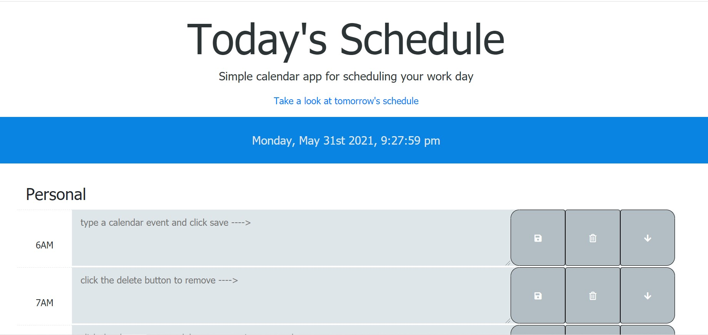
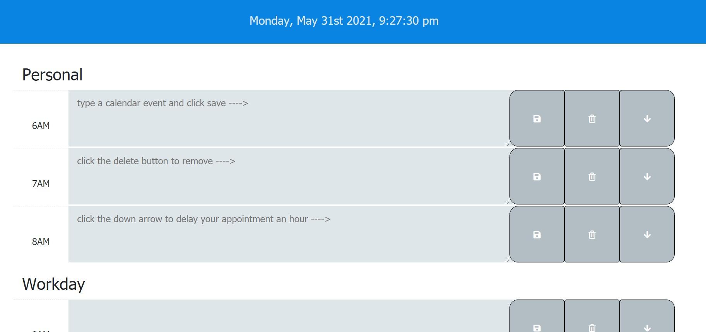
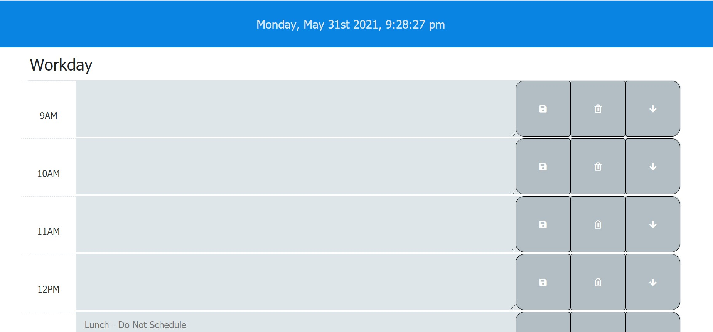

https://github.com/Jason-M-Bailey/dailyplanner
https://jason-m-bailey.github.io/dailyplanner/

# 05 Third-Party APIs: Work Day Scheduler

A simple calendar application that allows a user to save events for each hour of the day. This app runs in the browser and features dynamically updated HTML and CSS powered by jQuery. 

Additional features include the ability to delete previously saved appointments, delay appointments by an hour and take a look at tomorrow's schedule. 
